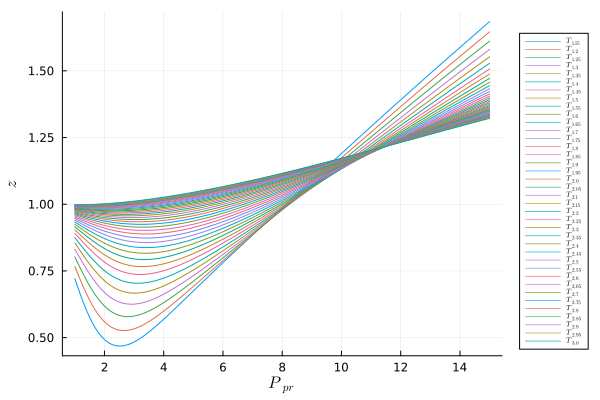

# Assignment 10


The file [assignment10.jl](src/assignment10.jl) has a function `z(Ppr, Tpr)` that will return the $z$ expansion
factor for a gas.  Your assignment is to use that function to create the
following plot that shows a range of correlation curves.



Implement your plotting code in the function `z_plot()` and have it return the
plot object.  Below are some tips to get things just right.

1. The pseudoreduced pressure $P_{pr}$ should range from 1 to 15 in steps of
   0.1

1. The pseudoreduced temperature $T_{pr}$ curves should range from 1.15 to 3.0
   in steps of 0.05.

1. Use $\LaTeX$ fonts in your axis and legend labels. You may need to add the package `LaTeXStrings` to your project environment.
   The $\LaTeX$ code for generating a symbol $T_{pr}$ is `T_{pr}`.  See the
   [LaTeXStrings package
   documentation](https://github.com/stevengj/LaTeXStrings.jl) to see how to
   use it and do [string
   interpolation](https://docs.julialang.org/en/v1.7/manual/strings/#string-interpolation).
   
1. Set the legend position to be `outerright` and set the legend font size to
   be `5`.  See the [Plots.jl attributes
   documentation](https://docs.juliaplots.org/stable/generated/attributes_subplot/) for the exact keywords. 

1. You don't need to specify the colors of the lines in any way.  Just use the
   default color cycle.


## Testing

To see if you answers are correct, run the following command at the Terminal
command line from the repository's root directory

```bash
julia --project -e "using Pkg; Pkg.test()"
```

the tests will run and report if passing or failing.

After you have the tests passing on Github, check back in on the repository on Github and look for a new branch called `create-pull-request/patch` to view the PDF that was automatically generated. This demonstrates how to include a Plots.jl figure in a document and have the math fonts in the figure and in the text match exactly.
